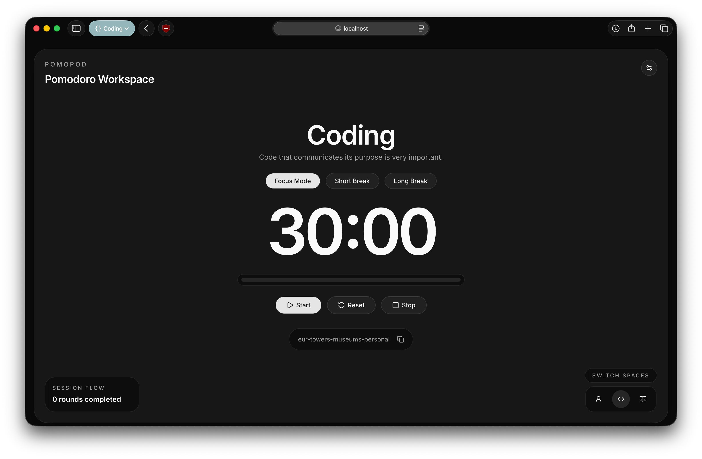
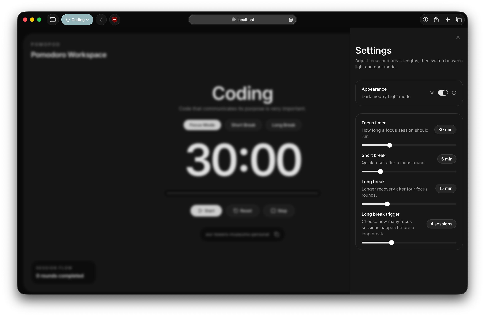

<div align="center">

# PomoPod

**Boost your productivity, together. A multiplayer Pomodoro timer for you and your friends.**

[](https://reactjs.org/)
[](https://fastapi.tiangolo.com/)
[](https://www.python.org/)
[](https://opensource.org/licenses/MIT)

</div>

---

## About

Studying or working alone can sometimes feel isolating. **PomoPod** bridges the gap by allowing you to create and join "Pods" with your friends to collaborate, focus, and take breaks together. It brings accountability and community directly into your productivity workflow.

## Key Features

- **Core Pomodoro Timer:** The classic productivity technique built right in.
- **Fully Customizable:** Tailor focus sessions and break durations to your own workflow.
- **Multiplayer Pods:** Seamlessly host or join private rooms (pods) to sync your focus sessions with friends.
- **Adaptive Theming:** A beautiful UI that natively supports both Light and Dark modes.

---

## Screenshots

### App Screen



### Settings



## Tech Stack

This project is built using modern tooling to ensure high performance and developer velocity:

- **Frontend:** React
- **Backend:** Python (FastAPI)
- **Package Managers:** [`pnpm`](https://pnpm.io/) for Node, and [`uv`](https://github.com/astral-sh/uv) for lightning-fast Python management.

---

## Getting Started

### Prerequisites

Before you begin, ensure you have the required package managers installed on your local machine:

- [**uv**](https://github.com/astral-sh/uv)
- [**pnpm**](https://pnpm.io/)

### ⚙️ Installation

**1. Clone the repository**

```bash
git clone https://github.com/ankitsm08/pomopod.git
cd pomopod
```

**2. Set up the Backend**

```bash
cd backend
uv sync
```

**3. Set up the Frontend**

```bash
cd ../frontend
pnpm install
```

---

## Running the App

To run PomoPod locally, you will need to start both the backend and frontend servers.

### Backend

You can run the backend directly through `uv`:

```bash
cd backend
uv run pomopod --help
```

_Alternatively, you can activate the virtual environment first:_

```bash
cd backend
source .venv/bin/activate
pomopod --help
```

### Frontend

In a separate terminal, start the React development server:

```bash
cd frontend
pnpm dev
```

---

## License

This project is [MIT licensed](LICENSE).

---

## Developers

<div>
  <i>Backend developed and maintained by <a href="https://github.com/ankitsm08">Ankit</a></i><br>
  <i>Frontend developed and maintained by <a href="https://github.com/SamimNaser">Samim</a></i>
</div>
